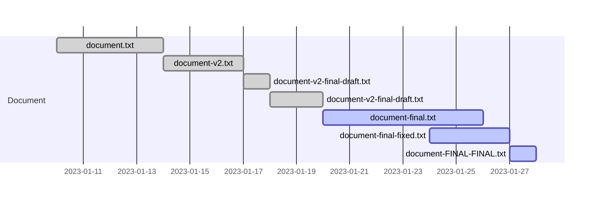

- Explain the importance of version control in software development.
- Highlight the problems it solves.

# Introduction to Version Control Systems

Have you ever worked on a project and saved multiple versions of the same file, such as "document.txt", "document_v2.txt", and "document_final.txt"? Or maybe you've lost a previous version of your work and wished you could go back to it? This is where version control systems (VCS) come in.

A version control system is a tool that allows you to track changes to your files and collaborate with others on a project. It keeps a history of all the changes made to the files and allows you to revert to previous versions if needed. This can be especially useful when working on large projects with multiple people, as it allows you to track who made what changes and when.

There are different types of version control systems, such as centralized systems (e.g. Subversion) and distributed systems (e.g. Git). In this workshop, we'll be focusing on Git, which is a distributed version control system.

Here are some key benefits of using a version control system:
- Keep track of changes made to files over time
- Revert to previous versions of files if needed
- Collaborate with others on a project
- Track who made what changes and when

## Versioning without a VCS

Imagine working on a project and saving multiple versions of the files, without using a version control system. Your project folder might look something like this:

```bash
my-project 
├── document_v1.txt 
├── document_v2.txt 
├── document_final_draft.txt 
├── document_final_draft2.txt 
├── document_final.txt 
├── document_final_fixed.txt 
└── document_FINAL_FINAL.txt
```

As you can see, this quickly becomes difficult to keep track of. Which version is the final version? Which version did you send to your collaborators? And what happens when multiple people are working on the same project and saving their own versions of the files?



This is where version control systems come in. They allow you to keep track of the changes made to your files over time, and collaborate with others on a project without the confusion and chaos of versioning without a VCS. With a VCS, you can easily track who made what changes and when, and collaborate with others on a project without worrying about conflicts or losing important changes. This is especially important when multiple people are working on the same project and making changes in parallel, as it allows them to easily merge their changes together without conflicts or confusion.

## Concepts of VCS

A version control system is a powerful tool that allows you to keep a record of changes made to your files over time. It maintains a history of all the modifications made to the files, and enables you to easily revert to previous versions if required. This feature can be extremely beneficial when working on large projects with multiple collaborators, as it allows you to monitor who made what changes and when.

A VCS also provides the capability to create branches from the main codebase, which allows multiple individuals to work independently on the same codebase without impacting the primary version. This allows you to work on new features, fix bugs and make other changes without affecting the main codebase until you are ready to merge them back in.

Moreover, a VCS facilitates collaboration by allowing multiple users to work on the same files and seamlessly merge their changes together. This way, you can share your work with others, and also view the changes they made and merge them with your work.

## Short History of VCS

The concept of version control has been around for decades. Early systems such as IBM's Source Code Control System (SCCS) and the Revision Control System (RCS) were developed in the 1970s and 1980s, respectively. These systems allowed for basic version control and tracking of changes made to software projects.

In the 1990s, Concurrent Versions System (CVS) was developed. This system built upon the foundations of RCS and introduced support for multiple developers working on the same project simultaneously. CVS became the standard for open-source projects and is still used today.

The early 2000s saw the introduction of Subversion (SVN), which was designed to improve upon CVS with new features such as atomic commits and better branching and merging capabilities.

In 2005, Git was developed by Linus Torvalds. Its design focused on speed, efficiency and distributed version control, making it quickly became the most widely used VCS in the world. Today, Git is the standard VCS for software development and is used by many of the world's largest and most complex software projects.
