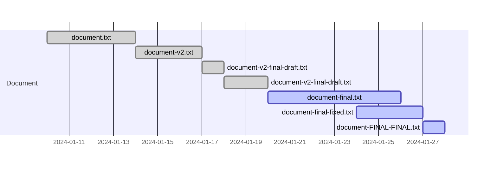

# Introduction to Version Control Systems

Have you ever found yourself juggling multiple versions of a file, like "document.txt," "document_v2.txt," and "document_final.txt"? Or perhaps you've experienced the frustration of losing a previous version of your work and wishing you could revert to it? This is where version control systems (VCS) come to the rescue.

A version control system is an invaluable tool that empowers you to monitor changes to your files and collaborate seamlessly on projects. It maintains a detailed history of all alterations made to your files and allows you to revert to prior versions when necessary. This becomes especially vital when working on sizable projects with multiple contributors, as it enables you to trace who made specific changes and precisely when they did so.

There are various types of version control systems, including centralized systems (e.g., Subversion) and distributed systems (e.g., Git). In this workshop, our focus will be on Git, a distributed version control system.

Here are key advantages of employing a version control system:

- Keep a chronological record of file changes
- Easily revert to previous file versions if required
- Collaborate efficiently with others on a project
- Trace the origin of each change and when it occurred

## The Perils of Versioning Without a VCS

Imagine working on a project and resorting to saving numerous versions of your files without the aid of a version control system. Your project folder might end up looking like this:

```bash
my-project 
├── document_v1.txt 
├── document_v2.txt 
├── document_final_draft.txt 
├── document_final_draft2.txt 
├── document_final.txt 
├── document_final_fixed.txt 
└── document_FINAL_FINAL.txt
```

This quickly becomes a challenging situation to manage. Which version represents the true final version? Which version was sent to collaborators? What happens when multiple team members are simultaneously working on the project, each saving their own versions of the files?



This is where version control systems shine. They not only allow you to meticulously track changes to your files over time but also enable seamless collaboration without the confusion and chaos associated with versioning without a VCS. With a VCS, you can effortlessly discern who made specific changes and when, facilitating smooth collaboration, even when multiple contributors are working concurrently.

## Key Concepts of VCS

A version control system is a potent tool for documenting the evolution of your files. It maintains an exhaustive history of modifications, empowering you to revert to previous states with ease. This capability proves invaluable when tackling extensive projects with multiple collaborators.

Moreover, a VCS introduces the concept of branching, allowing individuals to work independently on the same codebase without interfering with the primary version. This feature enables you to develop new features, fix bugs, and implement changes without affecting the main codebase until you're ready to merge them.

Additionally, a VCS streamlines collaboration by enabling multiple users to work on the same files and merge their changes seamlessly. You can share your work with others, review their contributions, and effortlessly incorporate them into your own.

## A Brief History of VCS

The concept of version control has a rich history spanning several decades. Early systems like IBM's Source Code Control System (SCCS) and the Revision Control System (RCS) emerged in the 1970s and 1980s, providing rudimentary version control and change tracking capabilities for software projects.

The 1990s witnessed the development of Concurrent Versions System (CVS), which built upon the foundations of RCS and introduced support for multiple developers working concurrently on a project. CVS became the standard for open-source projects and remains in use today.

In the early 2000s, Subversion (SVN) emerged as an improvement over CVS, offering features such as atomic commits and enhanced branching and merging capabilities.

In 2005, Git, conceived by Linus Torvalds, revolutionized version control with its focus on speed, efficiency, and distributed version control. It swiftly became the dominant VCS globally and is now the standard choice for software development, including many of the world's largest and most complex projects.
