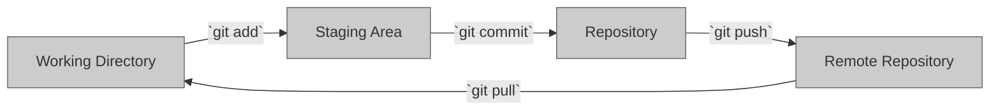

- Define Git and its role in version control.
- Mention key Git features and benefits.

# Introduction to Git

Now that you understand the importance of version control systems, let's take a deeper look at Git and how it can help you manage your projects.

So, what is Git? In simple terms, Git is a version control system that allows you to keep track of changes made to your files over time. It provides the capability to create branches from the main codebase, which allows multiple individuals to work independently on the same codebase without impacting the primary version. Git also facilitates collaboration by allowing multiple users to work on the same files and seamlessly merge their changes together.

In this section, we'll be diving deeper into Git and its features. We'll cover the main Git commands and workflows, and learn how to use Git to track changes, collaborate with others, and manage your codebase.

## Basic Git Commands

Before diving into Git's more advanced features, let's start by learning the basic commands. These commands will form the foundation of your Git workflow and will be used frequently.

- `git init`: This command is used to initialize a new Git repository. It creates a new `.git` directory in the current working directory, which contains all the necessary files for the version control system.
- `git add`: The `git add` command is used to add changes to the staging area. It allows you to select which changes you want to include in the next commit.
- `git commit`: The `git commit` command creates a new commit with the changes in the staging area. It allows you to add a message describing the changes made in the commit.
- `git push`: The `git push` command is used to push commits to a remote repository. It allows you to share your changes with others and collaborate on a project.
- `git pull`: The `git pull` command is used to pull changes from a remote repository. It allows you to retrieve updates made by others and merge them into your local repository.

### Other basic commands
We'll also cover some other basic commands such as `git status`, `git log` and `git diff` that will be useful for understanding the state of your repository and reviewing changes.

By the end of this section, you'll have a solid understanding of the basic Git commands and be able to use them to track changes and collaborate with others on a project.

## The different areas of git

Before diving into the basic Git commands, it's important to understand the different working areas in Git.

### The Working Directory
The working directory is the location on your computer where you have the files for your project. It's the area where you make changes to your files and where Git tracks those changes.

### The Staging Area
The staging area is a temporary storage area where you can review changes before committing them to the repository. It allows you to select which changes you want to include in the next commit.

### The Repository
The repository is where Git stores the snapshots of your project's files. Each commit creates a new snapshot of the files in the repository. The repository stores all the commits and their associated metadata, such as the author and the commit message.

### The Remote Repository
The remote repository is a copy of the repository that is stored on a remote server, such as GitHub. It allows multiple users to collaborate on a project by sharing their changes and merging them together.

By understanding the different working areas in Git, you'll have a better understanding of how Git tracks changes and how the basic commands operate.



## What is a Commit
A commit is a snapshot of your project's files at a specific point in time. It includes the changes made to the files since the last commit, as well as metadata such as the author and the commit message.

When you make changes to your files in the working directory and use the `git commit` command, those changes are saved as a new snapshot in the repository. Each commit is given a unique identifier, called a SHA (Secure Hash Algorithm), that allows you to refer to it later.

Commits are stored in a linear fashion, with each new commit building on top of the previous one. This creates a history of changes made to the project over time, which can be used to track progress, collaborate with others, and revert to previous versions of the project.


### Example Project
Let's say you're working on a project called "my-project" and you want to use Git to track the changes you make to the project.

First, navigate to the directory where you want to create the project and initialize a new Git repository using the `git init` command. This will create a new `.git` directory in the current working directory, which contains all the necessary files for the version control system.

```bash
$ cd my-project
$ git init
```

Now let's say you've made some changes to the files in the project. Use the `git status` command to see the changes that have been made in the working directory.

```bash
$ git status On branch master

No commits yet

Untracked files: (use "git add <file>..." to include in what will be committed)

file1.txt 
file2.txt 
file3.txt

nothing added to commit but untracked files present (use "git add" to track)
```

To include the changes in the next commit, use the `git add` command to add the changes to the staging area.

```bash
$ git add file1.txt file2.txt file3.txt
```

Now use the `git status` command again to see the changes that have been added to the staging area.

```bash
$ git status On branch master

No commits yet

Changes to be committed: (use "git rm --cached <file>..." to unstage) 
new file: file1.txt 
new file: file2.txt 
new file: file3.txt
```

Finally, use the `git commit` command to create a new commit with the changes in the staging area.

```bash
$ git commit -m "Initial commit"
```

You can use `git log` command to see all the commits made in the project.

```bash
$ git log
commit 9a5c1a5b5f5b5a5c5c5b5f5a5c5a5b5a5b5f5c5b5a5c5a5b5a5b5f5c5b5a5c
Author: Nico Harms <nico.harms@awi.com>
Date: Mon May 10 11:00:00 2021 +0100

 Initial commit

```

Another useful command when working with branches is `git log --all --graph --oneline`. This command shows a graphical representation of the commit history, including all branches and commits.

The `--all` flag shows commits from all branches and not just the current one. The `--graph` flag displays the commits in a visually pleasing format that allows for a quick overview of the branching and merging in the repository. And the `--oneline` flag shows the commits in a compact format, displaying only the first line of the commit message and the commit hash.

This command can be very helpful in understanding the history of a repository and keeping track of what changes were made and when. It also allows you to quickly identify merge conflicts and find the source of bugs.

You can also add `--decorate` to show the branches and tags, and `--color` to colorize the output.

By using these commands, you've created a new Git repository and made your first commit. This example project illustrates the basic Git commands and how they can be used to track changes to a project.

You can continue to make changes to the files in the project and use the `git add` and `git commit` commands to track the changes. It is also a good practice to use a meaningful message to describe the changes you've made in your commit.

Additionally, you can use the `git diff` command to see the differences between the working directory and the latest commit, and the `git show` command to see the details of a specific commit.

```bash
$ git diff 
$ git show 9a5c1a5b5f5b5a5c5c5b5f5a5c5a5b5a5b5f5c5b5a5c5a5b5a5b5f5c5b5a5c
```

## Real-World Applications of Git

Git is a powerful tool that can be used in a wide variety of industries and fields beyond software development. Some examples include:

- Academia: Researchers can use Git to track changes in their research papers and collaborate with other researchers.
- Data Science: Data scientists can use Git to manage their code and data, and collaborate with other team members.
- Design: Graphic designers and web designers can use Git to keep track of different versions of their designs and collaborate with other team members.
- Writing: Writers can use Git to keep track of different versions of their writing and collaborate with editors and other writers.

These are just a few examples of the many ways that Git can be used in the real world. If you're interested in learning more, you can check out the following resources:

- https://walkingrandomly.com/?p=6653
- https://valohai.com/blog/git-for-data-science/
- https://www.uxpin.com/studio/blog/git-for-designers/
- https://www.gitkraken.com/gitkon/git-for-writers