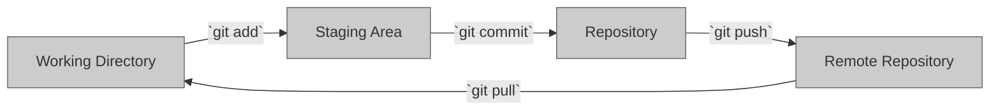
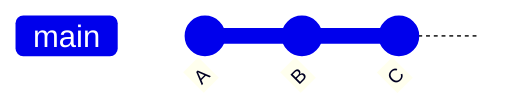
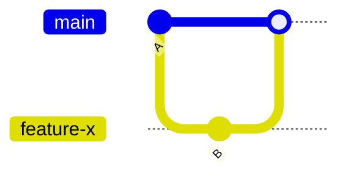

    - Cover Git terminology (repository, commit, branch, etc.).
    - Explain the three main stages of Git (working directory, staging area, repository).
    - Demonstrate basic Git commands (init, add, commit, status).

# Git Basics

## The different areas of git

Before diving into the basic Git commands, it's important to understand the different working areas in Git.

### The Working Directory
The working directory is the location on your computer where you have the files for your project. It's the area where you make changes to your files and where Git tracks those changes.

### The Staging Area
The staging area is a temporary storage area where you can review changes before committing them to the repository. It allows you to select which changes you want to include in the next commit.

### The Repository
The repository is where Git stores the snapshots of your project's files. Each commit creates a new snapshot of the files in the repository. The repository stores all the commits and their associated metadata, such as the author and the commit message.

### The Remote Repository
The remote repository is a copy of the repository that is stored on a remote server, such as GitHub. It allows multiple users to collaborate on a project by sharing their changes and merging them together.

By understanding the different working areas in Git, you'll have a better understanding of how Git tracks changes and how the basic commands operate.

## What is a Commit
A commit is a snapshot of your project's files at a specific point in time. It includes the changes made to the files since the last commit, as well as metadata such as the author and the commit message.

When you make changes to your files in the working directory and use the `git commit` command, those changes are saved as a new snapshot in the repository. Each commit is given a unique identifier, called a SHA (Secure Hash Algorithm), that allows you to refer to it later.

Commits are stored in a linear fashion, with each new commit building on top of the previous one. This creates a history of changes made to the project over time, which can be used to track progress, collaborate with others, and revert to previous versions of the project.

## What is a Branch

A branch is a parallel version of a repository. It allows you to work on a project without affecting the main codebase. This is useful when you want to experiment with new features or make changes to the codebase without impacting the main version.

When you create a new branch, it is based on the current state of the repository. This means that any changes made to the files in the repository will also be reflected in the new branch. However, any changes made to the files in the new branch will not be reflected in the repository until you merge the branch back into the main codebase.

