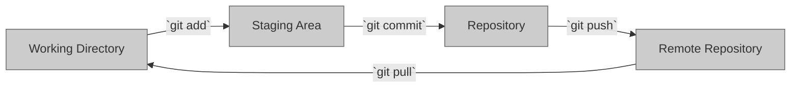
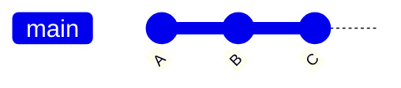
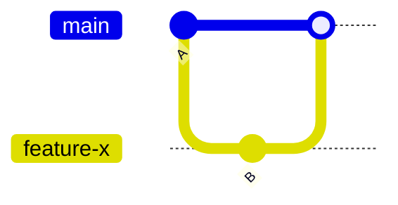

# Git Basics

Version control is a fundamental concept in software development. It helps you manage changes to your codebase efficiently, collaborate with others, and track the history of your project. In this chapter, we'll cover the key aspects of version control in the context of Git.

## Git Terminology

Git introduces several essential terms that you need to grasp to work effectively with it:

- **Repository**: A repository (or repo) is a container for your project. It holds all the files, directories, and the entire history of changes for your project.
- **Commit**: A commit represents a snapshot of your project's files at a specific point in time. It includes changes made since the last commit, along with metadata like the author's name and a commit message.
- **Branch**: A branch is a parallel version of your repository. It allows you to work on new features or changes without affecting the main codebase. Changes made in a branch can be merged back into the main codebase when ready.

## The Three Main Stages of Git

Git operates in three primary working areas, each serving a unique purpose:

- **The Working Directory**: This is where you have the project's files on your local machine. It's where you make changes to your code.
- **The Staging Area**: The staging area acts as a temporary holding space. You use it to review and select changes you want to include in the next commit.
- **The Repository**: The repository stores snapshots of your project's files, creating a history of commits. It holds all the commit data and metadata.
- **The Remote Repository**: The remote repository is a critical aspect of Git's distributed nature. It's a copy of the repository stored on a remote server, such as GitHub or GitLab. Here's why it matters:
  - Collaboration: The remote repository enables collaboration among multiple users. Team members can push their changes to the remote repository, making it accessible to others.
  - Backup and Sharing: The remote repository serves as a backup of your project and allows you to easily share your codebase with others.
  - Pulling Changes: You can pull changes from the remote repository to your local copy, ensuring you're working with the latest codebase.
  - Centralized Storage: Storing your project remotely provides a centralized location for your code, making it accessible from different devices and locations.

By understanding the different working areas in Git, you'll have a better understanding of how Git tracks changes and how the basic commands operate.

## What is a Commit

A commit is a crucial concept in Git that captures the state of your project's files at a specific point in time. It plays a vital role in version control by recording changes, authorship details, and commit messages. Here's a more structured presentation:

- **Definition**: A commit is a snapshot of your project's files at a particular moment in time.
- **Contents**: Each commit includes:
  - Changes made to the files since the last commit.
  - Metadata such as the author's name and a commit message.
  - A unique identifier known as a SHA (Secure Hash Algorithm) for future reference.
- **Linear History**: Commits are stored in a linear fashion, with each new commit building on top of the previous one. This sequential history helps track progress, collaborate with others, and revert to previous project versions.

## What is a Branch

Branches are essential for parallel development and managing changes to your codebase without affecting the main version. Here's an improved version of this section:

- **Definition**: A branch in Git is a parallel version of your repository. It enables you to work on a project independently without altering the main codebase.
- **Creating a Branch**: When you create a new branch, it starts based on the current state of the repository. This means that any changes made to the files in the repository will also be reflected in the new branch initially.
- **Isolation**: Branches provide isolation, allowing you to experiment with new features or make changes to the codebase without impacting the main version. Changes made in a branch do not affect the repository until you merge the branch back into the main codebase.

