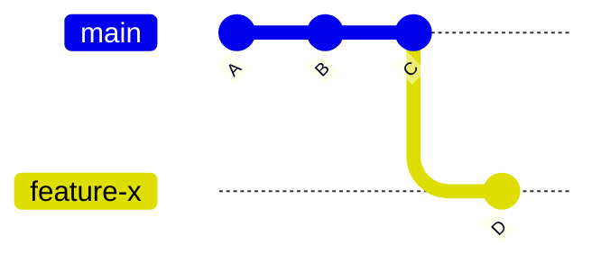
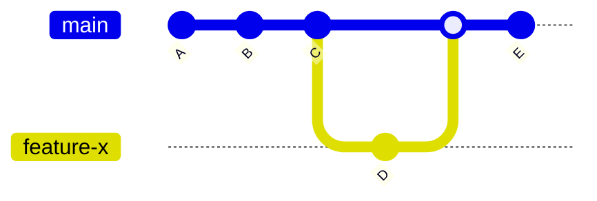
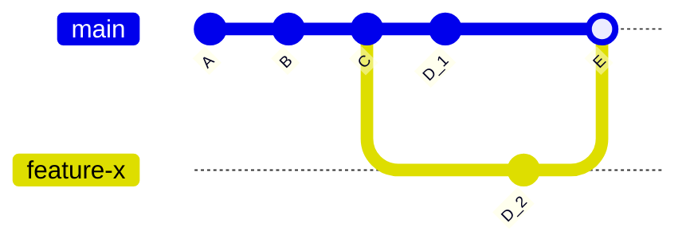

    - Introduce branching concepts.
    - Explain how to create, switch, and merge branches.
    - Discuss merge conflicts and their resolution.

# Branching and Merging

In Git, a branch is a separate line of development that allows you to make changes to your code without affecting the main branch. The main branch is usually called `master`, but it can also be called `main`. This allows you to experiment with new features, fix bugs, and make other changes without risking breaking the main branch.

To create a new branch, you can use the `git switch` command followed by the name of the new branch. For example, to create a new branch called `feature-x`, you would use the following command:

```bash
$ git switch -c feature-x
```

After switching to the new branch and creating the first commit, our git graph will look like this:



To switch to a different branch, you can use the `git switch` command followed by the name of the branch. For example, to switch to the `feature-x` branch, you would use the following command:

```bash
$ git switch feature-x
```

Once you've made changes to the files in a branch, you can use the `git add` and `git commit` commands to track the changes, just like you would in the main branch.

When you're ready to merge the changes from a branch back into the main branch, you can use the `git merge` command followed by the name of the branch. For example, to merge the changes from the `feature-x` branch into the main branch, you would use the following command:

```bash
$ git switch main
$ git merge feature-x
```

This will merge the changes from the `feature-x` branch into the main branch, creating a new commit that represents the merge.



It's important to note that merging can sometimes lead to conflicts, which occur when the same lines of code have been modified in both the main branch and the feature branch. In that case, Git will ask you to resolve the conflicts manually.

Resolving Merge Conflicts

When you merge two branches, Git will automatically try to combine the changes from both branches. However, if there are conflicts between the changes, Git will not be able to automatically merge the branches and will instead create a merge conflict.



When a merge conflict occurs, Git will mark the conflicting lines in the files with special markers, and it will be up to you to decide which changes to keep and which to discard.

For example, let's say you have a file called `file.txt` in the main branch, and you've made changes to the same file in a feature branch. The main branch contains the following lines:

> Hello world

and the feature branch contains:

> Hello Git

When you try to merge the feature branch into the main branch, Git will not be able to automatically merge the changes and will mark the conflicting lines in the file like this:

```text
<<<<<<< HEAD
Hello world
=======
Hello Git
>>>>>>> feature-x
```

The `<<<<<<< HEAD` marker indicates the changes from the main branch, and the `=======` marker separates the conflicting changes from the main and feature branches. The `>>>>>>> feature-x` marker indicates the changes from the feature branch.

To resolve the conflict, you need to decide which changes to keep and which to discard. For example, you can edit the file to look like this:

> Hello Git

When you are done resolving the conflict, you need to stage and commit the changes.

```bash
$ git add file.txt
$ git commit
```

It's important to note that resolving merge conflicts can be a bit tricky, especially if you're not familiar with the changes that were made in both branches. It's always a good idea to review the changes and test the merge before committing.

## Merge Strategies

A fast-forward merge is a type of merge that simply moves the current branch to the latest commit of the branch being merged. This is used when the two branches have not diverged, and it does not create a new commit.

A merge commit, on the other hand, is a new commit that is created when merging two branches that have diverged. This type of merge creates a new commit that has multiple parents, one for each branch being merged. This allows for a clear historical record of when and how the branches were merged.

You can also force a merge commit with `git merge --no-ff` even when fast-forward merge is possible, and you can squash all commits of the branch you are merging into a single commit with `git merge --squash`