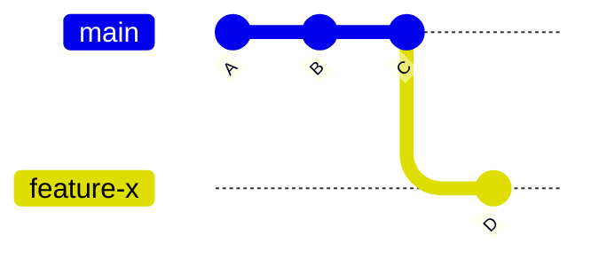
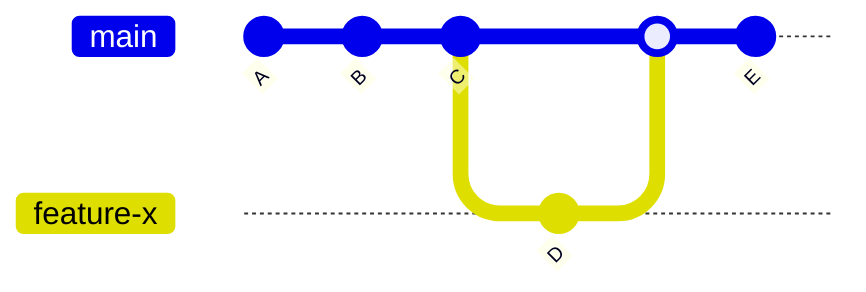
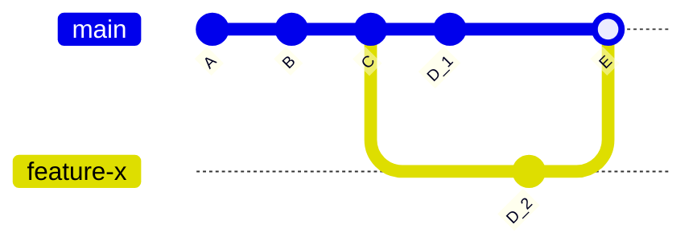

# Branching and Merging

In Git, branching and merging are fundamental concepts that allow developers to work on separate lines of development and later combine their changes. Understanding how to create branches, switch between them, and merge them is crucial for efficient collaboration and code management.

## Creating a Branch

To create a new branch, use the git switch command followed by the branch name. For example:

```bash
$ git switch -c feature-x
```

After creating the branch, your Git graph will look like this:



## Switching Between Branches

To switch to a different branch, use the `git switch` command followed by the branch name:

```bash
$ git switch feature-x
```

You can make changes to the branch files using git add and git commit just like in the main branch.

## Merging Branches

When ready to merge changes from a branch back into the main branch, use the `git merge` command:

```bash
$ git switch main
$ git merge feature-x
```

This action creates a new commit representing the merge:



## Handling Merge Conflicts

Merging can result in conflicts when the same lines of code are modified in both branches. Git marks conflicts in files with special markers, and you must resolve them manually.

For example, Git will mark conflicts in the file file.txt like this:



When a merge conflict occurs, Git will mark the conflicting lines in the files with special markers, and it will be up to you to decide which changes to keep and which to discard.

For example, let's say you have a file called `file.txt` in the main branch, and you've made changes to the same file in a feature branch. The main branch contains the following lines:

```text
Hello world
```

and the feature branch contains:

```text
Hello Git
```

When you try to merge the feature branch into the main branch, Git will not be able to automatically merge the changes and will mark the conflicting lines in the file like this:

```text
<<<<<<< HEAD
Hello world
=======
Hello Git
>>>>>>> feature-x
```

The `<<<<<<< HEAD` marker indicates the changes from the main branch, and the `=======` marker separates the conflicting changes from the main and feature branches. The `>>>>>>> feature-x` marker indicates the changes from the feature branch.

To resolve the conflict, you need to decide which changes to keep and which to discard. For example, you can edit the file to look like this:

```text
Hello World, this is Git
```

When you are done resolving the conflict, you need to stage and commit the changes.

```bash
$ git add file.txt
$ git commit
```

Resolving conflicts can be tricky, so review the changes and test the merge before committing.

## Merge Strategies

Understanding different merge strategies is essential:

- **Fast-Forward Merge**: Moves the current branch to the latest commit of the branch being merged when branches have not diverged, creating no new commit.
- **Merge Commit**: Creates a new commit with multiple parents when merging diverged branches, maintaining a clear historical record.
- **Forcing a Merge Commit**: Use git merge --no-ff to force a merge commit even when a fast-forward merge is possible.
- **Squashing Commits**: Combine all branch commits into a single commit with git merge --squash.
