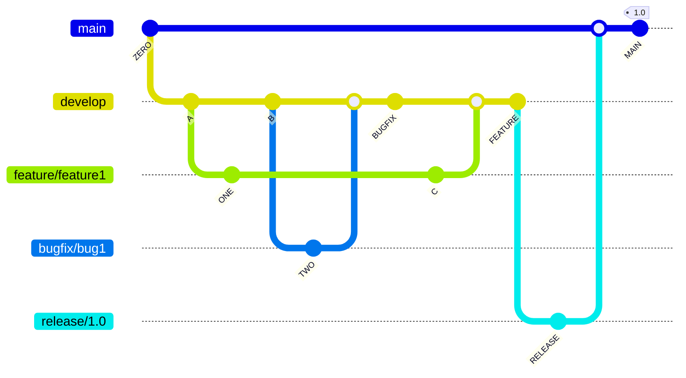
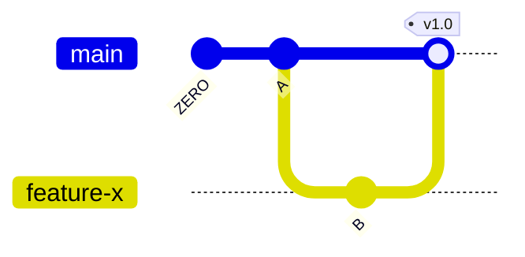
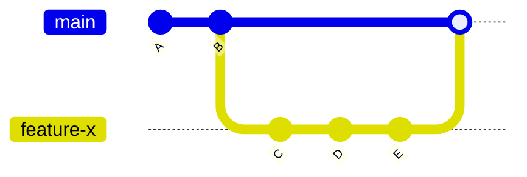

# Collaborative Git Workflows

There are several special Git workflows that are commonly used in software development. These workflows include:

## Gitflow Workflow

The Git Flow workflow is a popular branching model that uses separate branches for `production`, `development`, `releases`, `hotfixes` and `bugfixes`. The development branch, often called `develop`, is where all the new feature development happens. When a feature is ready to be released, it is merged into a release branch, where it undergoes final testing and bugfixing. When the release is ready, it is merged into the master branch, which represents the current production release. Hotfixes and bugfixes are also made in separate branches and then merged into both the develop and master branch as necessary. This workflow allows for a clear separation of concerns and makes it easy to track the progress of new features and bugfixes.

## GitLab Flow

This workflow is similar to Gitflow, but emphasizes on small and frequent releases. It uses a single branch called `main` for development and releases. Feature branches are created from `main` and are merged back into `main` when they are finished. Releases are created by tagging `main` with a release version number.

## Feature Branch Workflow

This is a Git workflow that allows multiple team members to work on different features in parallel. It involves creating a new branch for each feature, working on it independently, and then merging it back into the main branch (usually called "master" or "main") when it's ready to be released. This allows team members to work on multiple features at the same time without interfering with each other's work. In this workflow, the main branch is always kept in a releasable state and each feature is thoroughly tested and reviewed before being merged into the main branch. This workflow is commonly used in agile software development and is a popular choice among teams that need to frequently release new features.

Each of these workflows has its own advantages and disadvantages and should be chosen based on the specific needs of the project and the team.