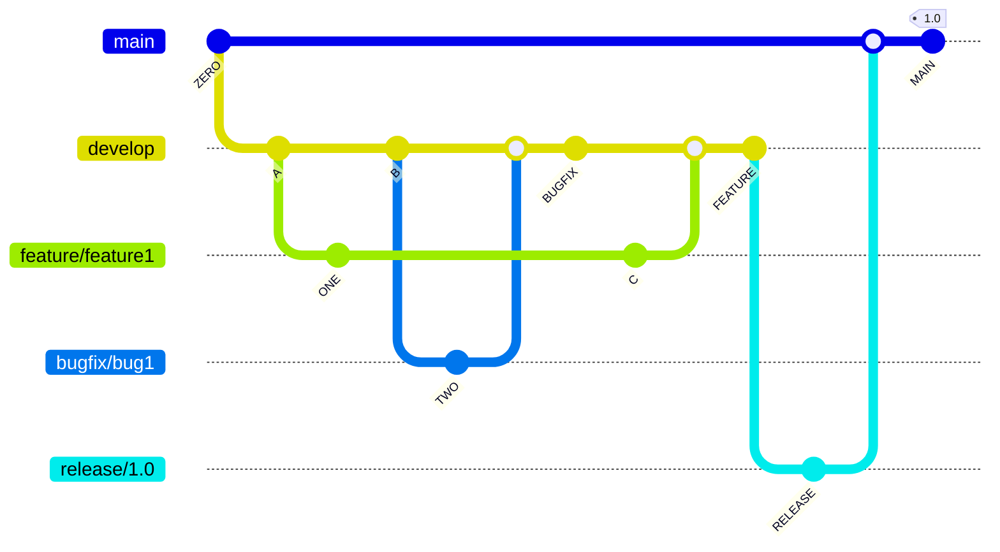
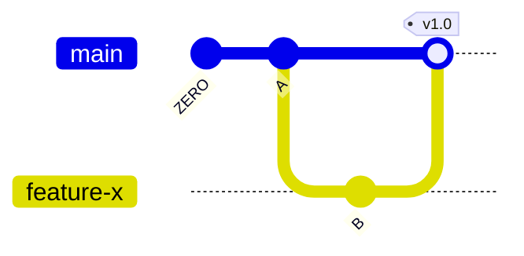
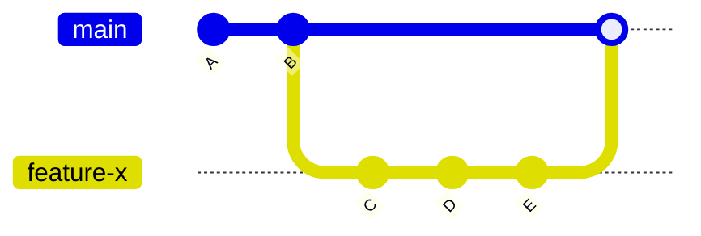

# Collaborative Git Workflows

In the world of Git and version control, various workflows cater to different project needs and team dynamics. Let's explore three commonly used Git workflows:

## Gitflow Workflow

The Gitflow workflow is a structured branching model designed to manage software development projects efficiently. It maintains separate branches for different purposes:

Key Branches:
- `develop`: The development branch where new feature development takes place.
- `release`: A branch for final testing and bugfixing before a release.
- `master`: Represents the current production release.
- `hotfix`: For addressing critical issues in the production release.

The Gitflow Workflow is ideal for larger projects with structured release cycles. It excels at separating concerns and tracking feature progress.

### Benefits

- Clear separation of concerns.
- Progress tracking for features and bugfixes.
- Suitable for projects with predefined release cycles.

### Drawbacks

- Complexity may be overwhelming for small projects.
- Requires discipline to maintain branch hygiene.

## GitHub/GitLab Flow

The GitHub/GitLab Flow is a streamlined workflow emphasizing small, frequent releases. It simplifies collaboration by using just one branch, `main`, for both development and releases. Feature branches are created from `main` and merged back when they are ready. Releases are tagged versions of `main`.

GitHub/GitLab Flow prioritizes simplicity and agility, making it suitable for projects that demand frequent releases and rapid development.

### Benefits

- Streamlined workflow for small to medium-sized projects.
- Emphasis on small, frequent releases.
- Reduces overhead compared to complex branching models.

### Drawbacks

- May lack structure for large-scale projects.
- Less separation between development and production.

## Feature Branch Workflow

The Feature Branch Workflow enables parallel development by allowing team members to work on multiple features simultaneously. It involves creating a branch for each feature, independent work, and merging it back into the main branch (often named "master" or "main") when it's ready for release.

The Feature Branch Workflow is versatile, allowing teams to work independently on various features without interfering with each other's work.

### Benefits

- Parallel development of multiple features.
- Each feature is thoroughly tested before merging.
- Suitable for agile development and frequent feature releases.

### Drawbacks

- Careful coordination is essential to avoid conflicts.
- Maintaining branch hygiene is crucial for success.

## More Workflows

- **Forking Workflow**: In this workflow, contributors fork the main repository, create their branches, make changes, and submit pull requests back to the main repository. It's commonly used in open-source projects to facilitate collaboration from external contributors.
- **Centralized Workflow**: Often used in smaller teams or for simpler projects, the Centralized Workflow involves a single "master" branch, and all developers push their changes directly to this branch. While it's straightforward, it can become problematic in larger and more complex projects.
- **Git Fork and Pull Workflow**: Popularized by platforms like Bitbucket, this workflow involves contributors forking a repository, making changes in their forks, and then sending pull requests to the main repository. It's similar to the Forking Workflow but doesn't require external contributors to clone the main repository.
- **Dictator and Lieutenants Workflow** (Linux Kernel): In the development of the Linux kernel, Linus Torvalds maintains the "master" branch and acts as the project's dictator. Trusted lieutenants manage various subsystems and maintain their own branches. This workflow is highly hierarchical and used for large-scale projects.
- **OneFlow**: OneFlow simplifies Git workflows by having a "main" branch and a "develop" branch, but it encourages continuous integration by enforcing a linear history and ensuring that all changes flow through the "develop" branch before being merged into "main."
- **Trunk-Based Development**: This approach focuses on maintaining a single, stable trunk or "main" branch. Developers work on small, incremental changes and continuously integrate them into the main branch. It's particularly useful for projects that prioritize rapid deployment and continuous delivery.

## Choosing the Right Workflow

By understanding these Git workflows in-depth, you can select the one that best aligns with your project's needs, team size, and development style. In the following sections, we will explore best practices, real-life examples, and use cases to further solidify your understanding of these workflows.

Each of these workflows has unique advantages and considerations, making them suitable for various project scenarios. Let's delve deeper into each workflow's specifics and when to choose them.

## Tips and Best Practices

To make the most of these workflows, consider the following tips and best practices:

- **Branch Hygiene**: Maintain a clean branch structure by regularly deleting feature branches that have been merged. This ensures a clutter-free repository.
- **Communication**: Encourage open communication among team members to avoid conflicts when merging changes. Use tools like pull requests and code reviews to facilitate collaboration.
- **Documentation**: Document the chosen workflow and branch conventions in your project's README or documentation to ensure consistency.