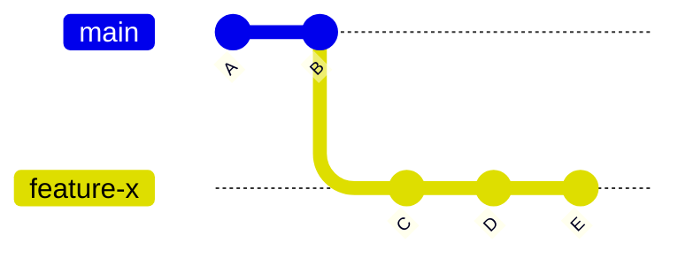
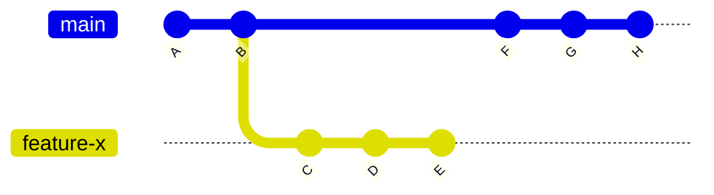
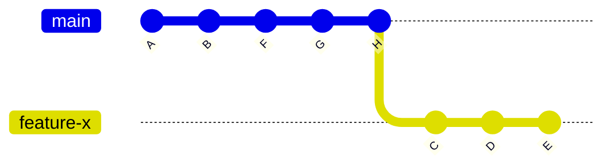
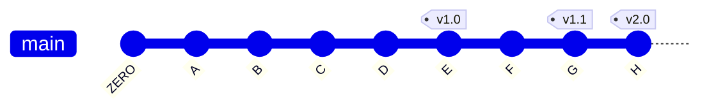

# Advanced Git Concepts

n this chapter, we delve into advanced Git concepts that extend beyond the basics. We'll explore the power of rebasing, the usefulness of tags, and the significance of special files in Git repositories.

## Understanding Git Rebasing

Git rebasing is a powerful technique that allows you to integrate changes from one branch into another by reapplying commits on top of a different branch. This approach proves invaluable when you want to keep your branch up to date with the latest changes in the main branch, all without creating a new merge commit.

### Why Use Rebasing?

Consider this scenario: you're working on a feature branch while the main branch receives new commits. In this case, you can employ git rebase to seamlessly apply your feature branch's commits on top of the most recent changes in the main branch.

Let's visualize this process:





```bash
$ git rebase main-branch
```



Rebasing can be more complex than merging, so understanding how it works and when to use it is crucial. Generally, it's recommended to avoid rebasing if you've already pushed your branch to a remote repository, as it can lead to conflicts with other collaborators.

## Leveraging Git Tags
In Git, a tag is a label you can apply to a specific commit. Tags are exceptionally useful for marking significant versions of your code, such as release versions.

You can create a new tag using the git tag command, followed by the name of the tag and the commit hash. To create a new tag called v1.0 for the latest commit, execute:

```bash
$ git tag v1.0
```

Let's visualize tagged commits:



You can also use `git tag` to list all tags in a repository and `git show` to see the details of a specific tag.

```bash
$ git tag
$ git show v1.0
```

## Git Stashing

Sometimes, you need to save your current changes temporarily without committing them. Git offers a solution: stashing. Stashing allows you to store your work in progress and switch to another branch or address unexpected changes.

### Why Use Stashing?

Imagine you're working on a feature, and a critical bug arises that requires immediate attention. Instead of committing your incomplete changes, which may break the code, you can stash them, fix the bug, and return to your changes later.

Here's how you stash changes:

```bash
git stash save "Work in Progress"
```

To retrieve your stashed changes:

```bash
$ git stash pop
```

or

```bash
$ git stash apply
```

Stashing is a handy tool when navigating complex workflows and addressing unforeseen challenges.

## Troubleshooting Common Git Issues

Advanced Git concepts can sometimes lead to unexpected challenges. Here, we address common issues and offer troubleshooting tips:

### Conflict Resolution

When rebasing or merging, conflicts may arise when Git cannot automatically reconcile changes. To resolve conflicts:

- Open the conflicting file(s) in your text editor.
- Manually edit the conflicting sections, keeping the desired changes.
- Save the file(s).
- Run `git add <file>` for each resolved file.
- Complete the rebase or merge with `git rebase --continue or git merge --continue`.

### Unwanted Commits

If you accidentally commit changes and want to undo them, use `git reset` or `git revert`. Use `git reset` for local changes and `git revert` for changes that have been pushed to a remote repository.

### Recovering Lost Commits

If you lose commits due to an accidental reset or rebase, Git's reflog can help you recover them. Use `git reflog` to view the history of HEAD movements and find the lost commit's reference.

### Best Practices

To make the most of advanced Git concepts, follow these best practices:

- **Regular Commits**: Commit frequently and keep each commit focused on a specific task or feature.
- **Descriptive Commit Messages**: Write clear and concise commit messages that explain the purpose of each commit.
- **Reviews**: Collaborate with team members through reviews to catch issues early.
- **Branch Naming**: Use consistent branch naming conventions to easily identify the purpose of each branch.
- Documentation: Maintain an up-to-date `README.md` to help others understand your project.

## Git's Special Files

Git and GitHub treat certain files differently, using them for configuring repositories and providing documentation. In this section, we'll explore some commonly used special files and their purposes.

### .gitignore

The `.gitignore` file specifies files and directories that Git should ignore. This helps exclude irrelevant files, such as temporary ones or those containing sensitive information. Use wildcards and path-based rules for flexibility.

```text
# Ignore PDF files
*.pdf

# Ignore all files with the .log extension 
*.log

# Ignore the vendor directory 
/vendor

# Ignore all JavaScript files in the vendor directory 
/vendor/*.js
```

### README.md

The README.md file provides a brief overview of the repository and its contents. Written in Markdown, it explains the project's purpose, installation instructions, usage guidelines, and features.

Example README.md:

```markdown
# My Project

This is a simple project that does something cool.

## Installation

To install the project, run the following command:

npm install my-project

## Usage

To use the project, run the following command:

my-project --option

## Features
- Feature 1
- Feature 2
- Feature 3
```

Including a `README.md` file in your repository helps others understand your project and its usage.

### Further Learning

Understanding these advanced Git concepts empowers you to use Git more effectively and efficiently in your projects.

To dive deeper into Git and GitHub/GitLab, explore the official documentation for comprehensive information on advanced concepts, best practices, and additional features.