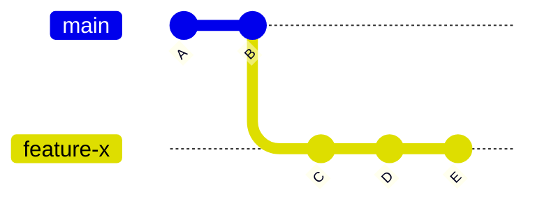
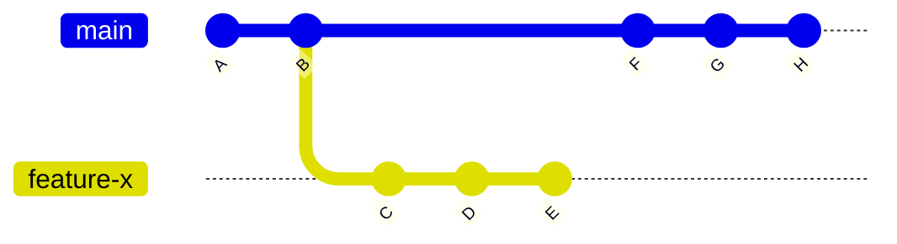
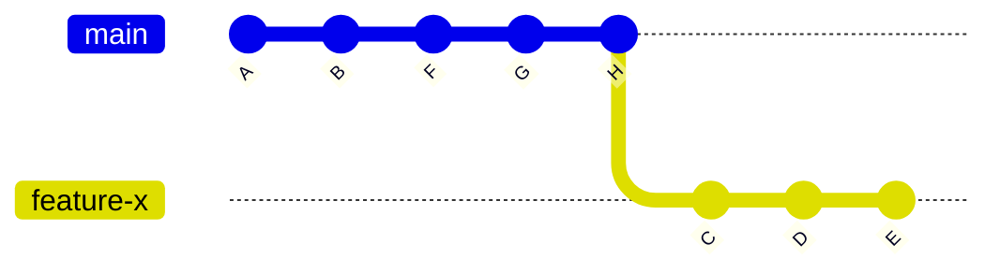
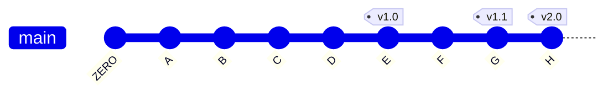

    - Cover more advanced Git topics, such as rebasing, cherry-picking, and submodules.
    - Provide resources for further learning.
# Advanced Git Concepts

While the basic Git commands are essential for managing and tracking changes to a project, there are also more advanced concepts that can be useful in certain situations.

## Rebasing

Rebasing is a way to integrate changes from one branch into another by reapplying commits on top of a different branch. This can be useful when you want to keep your branch up to date with the changes in the main branch, without creating a new merge commit.

For example, if you're working on a feature branch and the main branch has received new commits, you can use `git rebase` to apply your feature branch commits on top of the latest changes in the main branch.





```bash
$ git rebase main-branch
```



Rebasing can be a bit more complex than merging, and it's important to understand how it works and when to use it. In general, it's recommended to avoid rebasing if you've already pushed your branch to a remote repository, as it can lead to conflicts with other collaborators.

## Tags

In Git, a tag is a label that you can apply to a specific commit. This can be useful for marking a specific version of your code, such as a release version.

You can create a new tag by using the `git tag` command followed by the name of the tag and the commit hash. For example, to create a new tag called `v1.0` for the latest commit, you would use the following command:

```bash
$ git tag v1.0
```



You can also use the `git tag` command to list all tags in a repository, and the `git show` command to see the details of a specific tag.

```bash
$ git tag
$ git show v1.0
```

By understanding these advanced Git concepts, participants will be able to use Git more effectively and efficiently in their projects.

## Special files

When working with Git and Github, there are certain types of files that are treated differently than others. These files are commonly used to configure and manage the repository, as well as provide documentation and information about the project. In this section, we'll take a look at some of the most commonly used special files and their purpose.

The special files that we will cover include:

- `.gitignore`: This file is used to specify files and directories that should be ignored by Git.
- `README.md`: This file is used to provide documentation and information about the repository.

More examples of important directories of files:

- `.github` directory: This directory contains files and templates that are used to configure Github specific features such as issues, pull requests, and workflows.
- `.gitattributes`: This file is used to configure various attributes for files in the repository.
- `LICENSE`: This file typically contains the license information of the project, which describes how users can use, modify and distribute the code.

By understanding how these special files work and how to use them correctly, you can better manage your repository and make it more user-friendly for others who may want to contribute to your project. You can find out more about them in the documentation of git and github.

### .gitignore

The `.gitignore` file is used to specify files and directories that should be ignored by Git. This can be useful for excluding files that are not relevant to the repository, such as temporary files or files that contain sensitive information.

When creating a `.gitignore` file, you can specify the files or directories that you want to ignore by listing them one per line. You can use wildcards to match multiple files with a similar pattern. For example, you can use `*.log` to ignore all files with the `.log` extension in a directory.

It's also possible to ignore files and directories based on their path. For example, you can use `/vendor` to ignore the vendor directory, or `/vendor/*.js` to ignore all JavaScript files in the vendor directory.

It's important to note that the `.gitignore` file only affects untracked files, so if a file is already tracked by Git, it will not be ignored even if it is listed in the `.gitignore` file. To stop tracking a file that is already being tracked, you can use the command `git rm --cached <file>`.

Here is an example of a `.gitignore` file:

```text
# Ignore PDF files
*.pdf

# Ignore all files with the .log extension 
*.log

# Ignore the vendor directory 
/vendor

# Ignore all JavaScript files in the vendor directory 
/vendor/*.js
```

By using `.gitignore`, you can make sure that only relevant files are included in the repository, which can make it easier to manage and collaborate on the project.

### README.md

The `README.md` file is used to provide a brief overview of the repository and its contents. This can include information such as the purpose of the project, how to install and use it, and the available features.

`README.md` files are written in Markdown, a lightweight markup language that makes it easy to format text with headings, lists, links, and other formatting options. This allows you to provide a clear and easy-to-read documentation for your project.

It's a good practice to include a `README.md` file in the root directory of your repository as it makes it easy for anyone who comes across your repository to understand what it is and how it can be used.

Here is an example of a simple `README.md` file:

```markdown
# My Project

This is a simple project that does something cool.

## Installation

To install the project, run the following command:

npm install my-project

## Usage

To use the project, run the following command:

my-project --option

## Features
- Feature 1
- Feature 2
- Feature 3
```

By including a `README.md` file in your repository, you can help others understand what your project is and how they can use it.